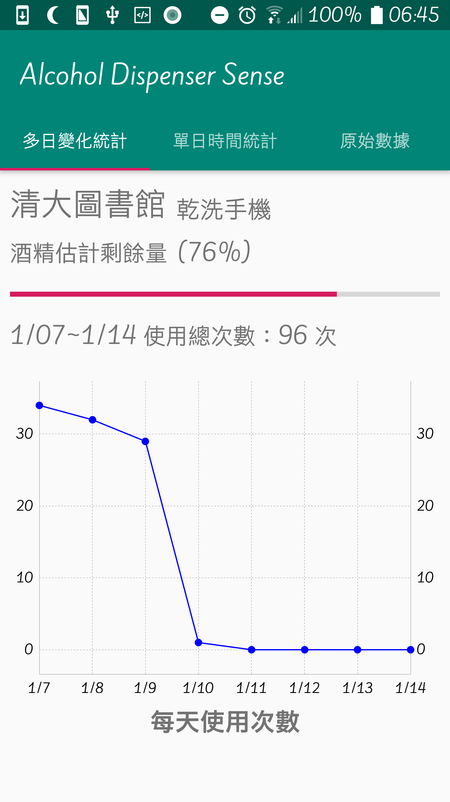

# Dispenser Monitor
This is an IoT project to monitor the utilization of automatic sanitizer dispensers. Several sensors, acting as publishers, are positioned alongside these automatic sanitizer dispensers to detect any vibrations they generate. These vibration-related data are then transmitted to an MQTT broker with a dedicated topic. Clients subscribed to this specific topic can retrieve this data from the MQTT broker.

From the data, we can compute the frequency of usage of the automatic sanitizer dispensers. Furthermore, it allows us to estimate the remaining alcohol level within the dispenser, facilitating timely refilling when it runs low. We can also evaluate the suitability of the installation location of the dispenser by analyzing its usage pattern and frequency.

## Work
Our work is to design and implement user interfaces to monitor the collected data received from the MQTT broker. We have developed two kinds of UIs: an Android application and a desktop website. These interfaces are presented comprehensive statistical charts, offering a visually intuitive representation of the data.

## Demo
Website
|  |  |
| :----------------------: | :----------------------: |
|  |  |

Android APP
|  |  |  |  |
| :---: | :---: | :---: | :---: |
